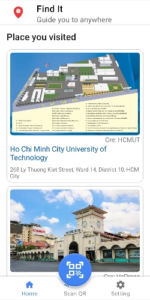
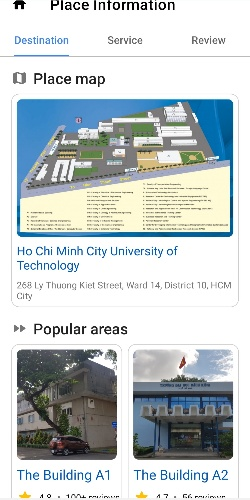
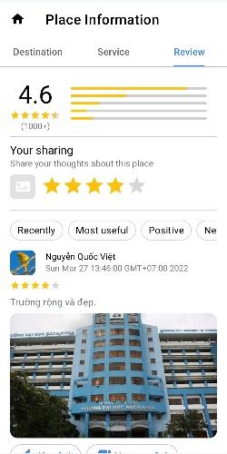
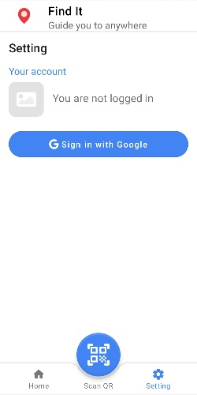
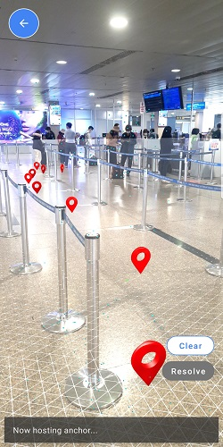
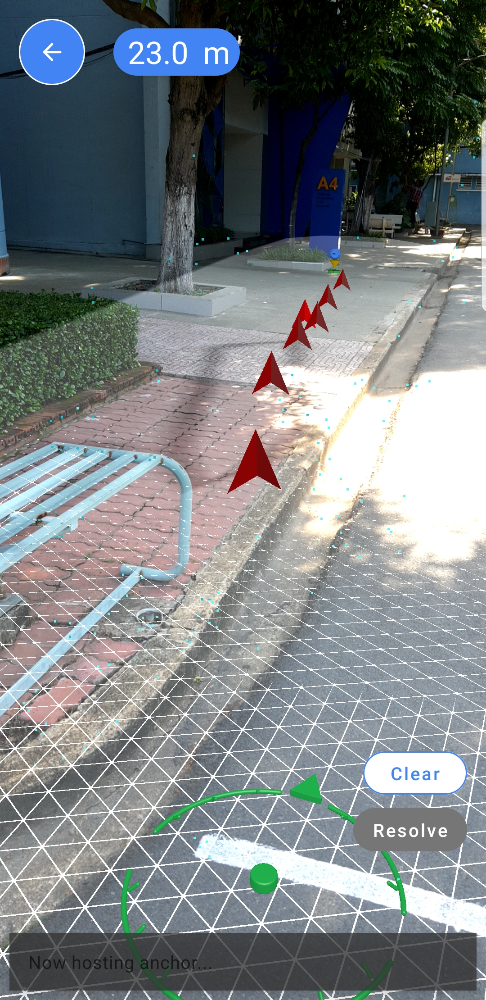

# Find It


> An app leveraging AR Core technology to help navigating and providing knowledge of places. <br>
> Live demo [Find It video](https://www.youtube.com/watch?v=5fJSGYPfJM8). <!-- If you have the project hosted somewhere, include the link here. -->

## Table of Contents
* [Overview](#overview)
* [How to run code?](#how-to-run-code)
* [Technologies Used](#technologies-used)
* [Screenshots](#screenshots)
* [Contact](#contact)
<!-- * [Room for Improvement](#room-for-improvement)
* [Acknowledgements](#acknowledgements) -->
<!-- * [License](#license) -->


## Overview
If you are from an area far away, going to a completely new place to attend an event, visiting campus for the first time as a new student or wanting to see what life out there, wandering throw places to raise knowledge about how big our world is. Maps will make you confuse a lot but not anymore because Find It is here to help.

Find It, what? Here our app allows users to review all detailed information about the destinations, giving practical suggestions so that users can have an overview of places. Applying the most advanced AR technology from Google, we pride ourselves in providing users with immersive experiences that blend reality and virtual worlds to guide their destination. Bring services and events held at the venue with dedicated instructions, step-by-step processes with an intuitive and beautiful user interface. Find It is an application designed for all users, especially travelers from far away. They no longer have to worry about finding a new place without a map or guide, and even save a lot of time because everything to do is just a fingertip away.

Download Find It: https://bit.ly/FindItApp

## How to run code
1. Install [Android Studio](https://developer.android.com/studio?gclid=CjwKCAjwopWSBhB6EiwAjxmqDTWtCY4Ih65UNlYy5IjL_RpfmRggMSPU3mYgsPmexEnSMjJ1BWxiEhoCUn4QAvD_BwE&gclsrc=aw.ds).
2. Install [Git](https://git-scm.com/book/en/v2/Getting-Started-Installing-Git).
3. Clone this repository (the main branch) on your computer by this commmand.
```
git clone https://github.com/SANGNGUYEN24/find-it.git
```
In my case, I used command prompt on my Window computer to clone this repo.


4. In your Android Studio, go to `File` -> `Open` -> navigate to the repo you have cloned, it named `find-it`


   and wait until Android Studio finishes indexing process

5. Connect Android Studio to a [physical smartphone](https://developer.android.com/studio/run/device) or an [emulator](https://developer.android.com/studio/run/emulator)

   For best experience, please run the app on a physical Android smartphone with Android 8 or higher.  
   
6. After connecting to the phone successfully, click run button  to build the app.

7. To test the app, you can scan one of following QR codes:

    _Increase screen brightness to make QR scanning smoother_.
    
        
    
    These QR codes are attached to Ho Chi Minh City University of Technology, Vietnam.
    
    To test the direction feature with AR map:
    
    - Firstly, LOGIN an account to the app (our Cloud Firestore security rules require you login to write data to database) 
    - Secondly, scan a QR code, the app will show you are standing somewhere. 
    - Thirdly, select any destination then scan the surrounding environment until a virtual mesh appears, 
    then you can act as admin to place some map pointers (anchor) , wait until the app notices that the anchors have been hosted.
    
        

    
    - Press the clear button, now you are acting as a visitor, press the resolve button to make the anchors you set earlier appear again.
    - At that time, the remaining distance bar will show you how far you have to go to your destination.

        

    That's exactly how the AR navigation feature in Find It works.
    
    
    


## Technologies Used
- Android with Kotlin, Java
- Firebase (Authentication, Cloud Firestore, Storage, ML Kit, App Distribution, Crashlytics)
- ARCore

## Screenshots





<!--  -->

<!-- 


 -->
<!-- If you have screenshots you'd like to share, include them here.


<!-- ## Setup
What are the project requirements/dependencies? Where are they listed? A requirements.txt or a Pipfile.lock file perhaps? Where is it located?

Proceed to describe how to install / setup one's local environment / get started with the project.
 -->

<!-- ## Usage
How does one go about using it?
Provide various use cases and code examples here.

`write-your-code-here`
 -->


<!-- ## Room for Improvement
Include areas you believe need improvement / could be improved. Also add TODOs for future development.

Room for improvement:
- Improvement to be done 1
- Improvement to be done 2

To do:
- Feature to be added 1
- Feature to be added 2
 -->

<!-- ## Acknowledgements
Give credit here.
- This project was inspired by...
- This project was based on [this tutorial](https://www.example.com).
- Many thanks to... -->


## Contact
Created by [@SANGNGUYEN24](https://github.com/SANGNGUYEN24), [@Proton2001](https://github.com/Pronton2001) and [@electrodrago](https://github.com/electrodrago) - feel free to contact us!


<!-- Optional -->
<!-- ## License -->
<!-- This project is open source and available under the [... License](). -->

<!-- You don't have to include all sections - just the one's relevant to your project -->
